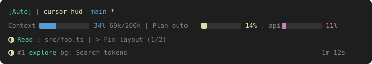

# cursor-hud

A real-time statusline HUD for **Cursor CLI** (`agent`) — context usage, active tools, running agents, and todo progress. Always visible below your input.

> 🌐 English | [中文文档](README.zh.md)

[](LICENSE)
[](https://github.com/huai-xia/cursor-hud/stargazers)



> **Inspired by [claude-hud](https://github.com/jarrodwatts/claude-hud)** by [Jarrod Watts](https://github.com/jarrodwatts).  
> Same product idea (native statusline + transcript), reimplemented for Cursor CLI’s payload, transcript quirks, and hooks.  
> If this helps you, a **star on this repo** is appreciated — and you’re also welcome to **star [claude-hud](https://github.com/jarrodwatts/claude-hud)**.

## Install

Requires **Node.js ≥ 18** and the Cursor CLI (`agent`).

**Step 1: Clone and build**

```bash
git clone https://github.com/huai-xia/cursor-hud.git
cd cursor-hud
npm install
npm run build
```

**Step 2: Wire the statusline**

```bash
npm run setup
```

This merges a `statusLine` entry into `~/.cursor/cli-config.json` (backup first) and installs `~/.cursor/cursor-hud.sh`.

Edit `cli-config.json` only when **no** `agent` session is running — sessions can overwrite it on exit.

**Step 3: Optional — Task running hooks**

```bash
npm run setup:hooks
```

Uses Cursor `preToolUse` for Task tools so the HUD can show agents as running earlier. See [Hooks](#hooks-optional).

**Step 4: Start a new session**

```bash
agent
```

The HUD appears in the footer after statusLine refreshes. If the footer height looks wrong after config changes, restart the session.

---

## What is cursor-hud?

cursor-hud gives you better insights into what's happening in your Cursor CLI session.

| What You See | Why It Matters |
|--------------|----------------|
| **Model badge** | Know which model / params you’re on |
| **Project path + git** | Know which project and branch you’re in (dirty `*`) |
| **Context health** | Know how full the context window is before it’s too late |
| **Plan usage** | First-party `auto` + third-party `api` plan bars |
| **Tool activity** | Watch reads, edits, and searches as they happen |
| **Agent tracking** | See which subagents are running and for how long |
| **Todo progress** | Track task completion in real time |

---

## What You See

### Default (`compact`)

Colored preview (GitHub renders SVG; plain code blocks cannot show ANSI colors):


```
[Auto] │ cursor-hud  main*
Context ████░░░░░░ 34% 69k/200k │ Plan auto ██░░░░░░░░ 14% · api █░░░░░░░░░ 11%
◐ Read: src/foo.ts │ ▸ Fix layout (1/2)
◐ #1 explore bg: Search tokens                         1m 12s
```

- **Line 1** — Model (cyan), path (yellow), git (blue)  
- **Line 2** — Context bar (blue→cyan→yellow→magenta) + plan `auto` (yellow) / `api` (magenta)  
- **Extra rows** — Tools / todos when active; each subagent on its own line (`#n` when ≥2), elapsed time on the right  

In your real terminal, colors come from ANSI (and optional truecolor in config).

### Expanded

Same core two lines, then tools / agents / todos each on their own row (`lineLayout: "expanded"`).

Tool paths are shown **relative to cwd / project_dir**.

---

## How It Works

cursor-hud uses Cursor CLI’s native **statusLine** command — no separate window, no tmux required, works in a normal terminal.

```
Cursor agent → stdin JSON → cursor-hud → stdout → footer under the prompt
            ↘ transcript JSONL (tools, agents, todos)
            ↘ optional hooks → agent-hooks.json (Task running)
```

**Key features:**
- Context % from Cursor’s `context_window` (not a guess)
- Plan usage from Cursor APIs (`auto` + `api`) with a short disk cache
- Parses the transcript for tools / agents / todos (Cursor-adapted heuristics)
- Compact footer by default (Cursor treats each stdout `\n` as a full footer row)

**Cursor-specific adaptations** (vs Claude Code / claude-hud):
- Transcripts often lack stable tool ids / `tool_result` → heuristic running/completed  
- Optional hooks: `preToolUse(Task)` marks agents **running**; Task `postToolUse` / `subagentStop` are unreliable on CLI today, so **completed** still follows the transcript  

---

## Configuration

Edit `~/.cursor/cursor-hud/config.json` (created as needed; see `fixtures/config.example.json`).

### Interactive configure vs npm publish (roadmap)

| Item | What it means | Status |
|------|----------------|--------|
| **Interactive configure** | A guided CLI/TUI (like claude-hud’s `/claude-hud:configure`) to pick presets, toggles, and colors without hand-editing JSON | **Not built yet** — edit `config.json` manually for now |
| **npm publish** | Publish this package to the [npm](https://www.npmjs.com/) registry so others can install with `npm i -g cursor-hud` instead of cloning | **Not published yet** — install via git clone as above |

### Layout presets (manual)

| Preset idea | Settings |
|-------------|----------|
| **Full** | `lineLayout: "expanded"`, `showCompletedTools: true`, tools/agents/todos on |
| **Essential** (default-ish) | `lineLayout: "compact"`, `showCompletedTools: false` |
| **Minimal** | Turn off `showTools` / `showAgents` / `showTodos` / `showPlanUsage` as you like |

### Options

| Option | Type | Default | Description |
|--------|------|---------|-------------|
| `lineLayout` | `compact` \| `expanded` | `compact` | Compact folds activity; expanded uses more footer rows |
| `pathLevels` | number \| `full` | `1` | Directory levels in the project path |
| `showModel` | boolean | `true` | Model badge |
| `showGit` | boolean | `true` | Git branch |
| `showDirty` | boolean | `true` | `*` when working tree is dirty |
| `showContextBar` | boolean | `true` | Context usage bar |
| `contextBarWidth` | number | `10` | Bar width in characters |
| `showPlanUsage` | boolean | `true` | Plan `auto` / `api` bars |
| `showTools` | boolean | `true` | Tool activity |
| `showCompletedTools` | boolean | `false` | Show `✓ Shell ×N` when idle |
| `showAgents` | boolean | `true` | Subagent lines |
| `showTodos` | boolean | `true` | Todo progress |
| `hooksAgentsEnabled` | boolean | `true` | Merge Task running marks from hooks |
| `toolNameMaxLength` | number | `0` | `0` = no truncation |
| `toolsMaxVisible` | number | `4` | Max completed tool name groups |
| `colors.*` | string / bar spec | see example | Fixed segments + context/plan bars |
| `thresholds` | object | `25/50/75/75` | Context bar mid/high/warn/crit |

Also set in `~/.cursor/cli-config.json`:

```json
{
  "statusLine": {
    "type": "command",
    "command": "~/.cursor/cursor-hud.sh",
    "padding": 0,
    "updateIntervalMs": 500,
    "timeoutMs": 2000
  }
}
```

`npm run setup` writes these for you.

### Colors example

```json
{
  "colors": {
    "model": "cyan",
    "path": "yellow",
    "git": "blue",
    "context": {
      "ok": "blue",
      "mid": "cyan",
      "high": "yellow",
      "warn": "magenta",
      "crit": "magenta"
    },
    "planAuto": { "ok": "yellow", "warn": "yellow", "crit": "yellow" },
    "planApi": { "ok": "magenta", "warn": "magenta", "crit": "magenta" }
  },
  "thresholds": { "mid": 25, "high": 50, "warn": 75, "crit": 75 }
}
```

Truecolor `"#RRGGBB"` and `"gradient": [...]` are optional.

### Hooks (optional)

```bash
npm run setup:hooks
npm run uninstall:hooks
```

| Env | Effect |
|-----|--------|
| `CURSOR_HUD_HOOKS=0` | Disable hook side-channel |
| `CURSOR_HUD_HOOKS_CAPTURE=1` | Also dump hook payloads under `~/.cursor/cursor-hud/hooks-capture/` |

Store file: `~/.cursor/cursor-hud/agent-hooks.json`. Probe notes: `fixtures/hooks/README.md`.

### Disabling the HUD temporarily

```bash
CURSOR_HUD_DISABLE=1 agent
```

No need to remove the `statusLine` entry from `cli-config.json`.

### Troubleshooting

**HUD not showing?**
- Start a **new** `agent` session after `npm run setup`
- Confirm `statusLine.command` in `~/.cursor/cli-config.json`
- Check `node` is on `PATH` (or set `CURSOR_HUD_NODE`)

**Extra blank footer rows?**
- Cursor renders **each stdout line** as a footer row
- Prefer `lineLayout: "compact"` and `showCompletedTools: false`
- Set `statusLine.padding` to `0`
- Restart `agent` if height looks stuck

**Config not applying?**
- Invalid JSON silently falls back to defaults
- Restart the session after layout changes

**Git status missing?**
- Run `agent` from inside a git repository

**Agents stuck on ◐ after finish?**
- Known Cursor CLI gap: Task `postToolUse` / `subagentStop` often don’t fire
- Completed state follows the transcript heuristic; hooks only help **running**

---

## Development

```bash
npm run build
npm run test:stdin
npm run test:hooks-merge
```

After a real `agent` turn, stdin captures land in `~/.cursor/cursor-hud/capture/` (local only; not in git).

---

## Credits & inspiration

- **[claude-hud](https://github.com/jarrodwatts/claude-hud)** by **[Jarrod Watts](https://github.com/jarrodwatts)** — the original statusline HUD for Claude Code. cursor-hud borrows the product idea and UX patterns, then reimplements them for **Cursor CLI**.
- Independent project — not affiliated with Anthropic or Cursor.
- **Stars welcome** here if cursor-hud helps you — and please also **star [claude-hud](https://github.com/jarrodwatts/claude-hud)** if you like the original.

---

## License

MIT
