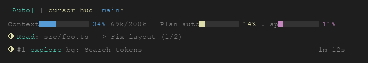

# cursor-hud

面向 **Cursor CLI**（`agent`）的实时 statusline HUD：上下文占用、工具、子 agent、todo 进度，始终显示在输入框下方。

> 🌐 [English](README.md) | 中文文档

[](https://www.npmjs.com/package/cursor-hud)
[](LICENSE)
[](https://github.com/huai-xia/cursor-hud/stargazers)

<p align="left"></p>

> **灵感来自 [claude-hud](https://github.com/jarrodwatts/claude-hud)**（作者 [Jarrod Watts](https://github.com/jarrodwatts)）。  
> 产品思路相同（原生 statusline + transcript），针对 Cursor CLI 的 payload、transcript 特性与 hooks 做了适配重写。  
> 如果本项目对你有用，欢迎给 **本仓库 star**；也欢迎给上游 **[claude-hud](https://github.com/jarrodwatts/claude-hud) star**。

## 安装

需要 **Node.js ≥ 18** 与 Cursor CLI（`agent`）。

### 方式 A — npm（推荐）

包：[`cursor-hud@0.1.0`](https://www.npmjs.com/package/cursor-hud)

```bash
npm install -g cursor-hud
cursor-hud-setup
cursor-hud-setup-hooks   # 可选
```

然后**新开** `agent` 会话。配置：`cursor-hud-configure`。

### 方式 B — 源码

**步骤 1：克隆并构建**

```bash
git clone https://github.com/huai-xia/cursor-hud.git
cd cursor-hud
npm install
npm run build
```

**步骤 2：挂载 statusline**

```bash
npm run setup
```

会合并写入 `~/.cursor/cli-config.json` 的 `statusLine`（先备份），并安装 `~/.cursor/cursor-hud.sh`。

请在**没有**正在运行的 `agent` 会话时再改 `cli-config.json`——会话退出时可能回写该文件。

**步骤 3（可选）：Task 运行态 hooks**

```bash
npm run setup:hooks
```

用 Cursor 的 `preToolUse`（Task）让 HUD 更早显示子 agent 为运行中。详见 [Hooks](#hooks可选)。

**步骤 4：新开会话**

```bash
agent
```

statusLine 刷新后会出现在 footer。改布局后若高度异常，重启会话。

---

## 这是什么？

在 Cursor CLI 会话里一眼看到关键状态：

| 你看到什么 | 为什么有用 |
|------------|------------|
| **模型徽章** | 当前模型 / 参数 |
| **项目路径 + git** | 在哪个项目、哪条分支（脏工作区 `*`） |
| **Context 条** | 上下文还剩多少 |
| **Plan 用量** | 一方 `auto` + 三方 `api` |
| **工具活动** | 正在读/写/搜什么 |
| **子 agent** | 谁在跑、跑了多久 |
| **Todo** | 任务完成进度 |

---

## 你看到的样子

### 默认（`compact`）

<p align="left"></p>

- **第 1 行** — 模型（青）、路径（黄）、git（蓝）  
- **第 2 行** — Context 条（蓝→青→黄→品红）+ Plan `auto`（黄）/ `api`（品红）  
- **额外行** — 有活动时的工具 / todo；每个子 agent 独占一行（≥2 时 `#n`），右侧为时长  

真实终端里颜色来自 ANSI（配置里也可开 truecolor）。

### 展开布局（`expanded`）

核心两行相同，工具 / agents / todos 各占一行。

工具路径相对 `cwd` / `project_dir` 显示。

---

## 原理

使用 Cursor CLI 原生 **statusLine** 命令——无需单独窗口、无需 tmux。

```
Cursor agent → stdin JSON → cursor-hud → stdout → 提示符下方 footer
            ↘ transcript JSONL（tools / agents / todos）
            ↘ 可选 hooks → agent-hooks.json（Task 运行态）
```

**相对 claude-hud / Claude Code 的适配：**
- transcript 常缺 tool id / `tool_result` → 启发式判断 running/completed  
- hooks：`preToolUse(Task)` 标 **running**；CLI 上 Task 的 `postToolUse` / `subagentStop` 目前不可靠，**completed** 仍跟 transcript  

---

## 配置

随时运行引导配置（全局安装后用 `cursor-hud-configure`，源码目录用 `npm run configure`）：

```bash
cursor-hud-configure
```

或直接编辑 `~/.cursor/cursor-hud/config.json`（参见 `fixtures/config.example.json`）。

### 引导配置

```bash
# npm 全局安装后：
cursor-hud-configure
# 源码目录内：
npm run configure
# 非交互：
npm run configure -- --preset=essential --yes
npm run configure -- --preset=minimal --reset-colors --yes
```

流程：选预设（Essential / Full / Minimal）→ 可选微调开关 → 配色 → 预览 → 写入 `~/.cursor/cursor-hud/config.json`（会先备份）。footer 高度异常时重启 `agent`。

### 布局预设（configure 或手改）

| 预设 | 内容 |
|------|------|
| **Essential** | compact；工具/agent/todo 开；空闲不显示已完成工具统计 |
| **Full** | expanded；显示已完成工具统计 |
| **Minimal** | 仅模型 + 路径/git + Context |

### 常用选项

| 选项 | 类型 | 默认 | 说明 |
|------|------|------|------|
| `lineLayout` | `compact` \| `expanded` | `compact` | compact 折叠活动行 |
| `pathLevels` | number \| `full` | `1` | 路径展示层级 |
| `showContextBar` | boolean | `true` | Context 条 |
| `showPlanUsage` | boolean | `true` | Plan 条 |
| `showCompletedTools` | boolean | `false` | 空闲时是否显示 `✓ Shell ×N` |
| `hooksAgentsEnabled` | boolean | `true` | 合并 hooks 的 running 标记 |
| `colors.*` / `thresholds` | — | 见示例 | 配色与阈值 |

`npm run setup` 会写入 `cli-config.json` 里的 `statusLine`（含 `padding: 0`）。

### 配色示例

```json
{
  "colors": {
    "model": "cyan",
    "path": "yellow",
    "git": "blue",
    "context": {
      "ok": "blue",
      "mid": "cyan",
      "high": "yellow",
      "warn": "magenta",
      "crit": "magenta"
    },
    "planAuto": { "ok": "yellow", "warn": "yellow", "crit": "yellow" },
    "planApi": { "ok": "magenta", "warn": "magenta", "crit": "magenta" }
  },
  "thresholds": { "mid": 25, "high": 50, "warn": 75, "crit": 75 }
}
```

### Hooks（可选）

```bash
npm run setup:hooks
npm run uninstall:hooks
```

| 环境变量 | 作用 |
|----------|------|
| `CURSOR_HUD_HOOKS=0` | 关闭 hooks 旁路 |
| `CURSOR_HUD_HOOKS_CAPTURE=1` | 额外落盘 hook 样本 |

### 临时关闭 HUD

```bash
CURSOR_HUD_DISABLE=1 agent
```

### 排障

**看不到 HUD？** 新开 `agent`；检查 `statusLine.command`；确认 `node` 在 PATH。  
**footer 多空行？** 用 `compact`、关掉 `showCompletedTools`、`padding: 0`，必要时重启会话。  
**子 agent 一直 ◐？** CLI 上 Task 完成事件常缺失；completed 靠 transcript，hooks 主要补 running。

---

## 开发

```bash
npm run build
npm run test:stdin
npm run test:hooks-merge
```

---

## 致谢

- **[claude-hud](https://github.com/jarrodwatts/claude-hud)** · **[Jarrod Watts](https://github.com/jarrodwatts)** — Claude Code 上的原版 statusline HUD。本项目借鉴其产品思路，并在 **Cursor CLI** 上重写适配。
- 独立项目，与 Anthropic / Cursor 无关。
- 欢迎给本仓 **star**；也欢迎给 **[claude-hud](https://github.com/jarrodwatts/claude-hud) star**。

---

## License

MIT
